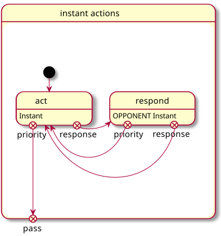
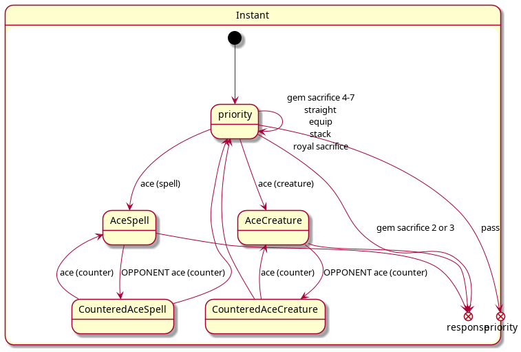

The rules of Superjack as a State Machine
=========================================

Introduction
------------

This is a formalization of the rules of Superjack as a state machine. The goal is to provide a description in a format that can easily be translated into code, while making it easy to review by a human. It is shown as UML state charts, rendered from text files using [PlantUML](https://plantuml.com/).

All the details of the rules are not present on those charts, but they show every state the game can be in, as well as every state transition.

Top-level game structure
------------------------

At the highest level, the game consists of the two players picking their starting hand (possibly doing a Mulligan once to get 5 new cards), then playing until at least one player reaches 0 life points.

Turns
-----

Playing the game is done in a succession of turns, alternating the current player (this is the `Playing` state on the top-level diagram).

There are multiple phase to a `Turn`. The `Defend` state and subsequent states are skipped if the current player does no declare any attacker. When the player passes, we start a new `Turn`, changing the current player.

There are multiple states during which it is possible for a player to play an instant action. Because of this repetition, the flow of instant actions is shown on a separate diagram, and states where this is possible are annotated below as `instant actions` (if the current player can take them) or `OPPONENT instant actions` (if the other player can take them).

Instant action flow
-------------------

When an instant action is possible in the `playing` diagram above, a player can pass but also has priority to perform instant actions (`act` in diagram below). That priority can be lost as the other player can respond to instant actions with actions of their own. When the opponent `respond`s, they can either pass (which returns priority for the player to `act`) or perform actions of their own, which can call for a response of their own (which returns priority for the player to `act` as well).

The detail of the `Instant` states, that can be used by either player depending on higher-level state, is described in another section.

Instant action details
----------------------

This applies when a player can perform instant actions, whether it is their turn or the opponent turn (see the `instant actions` and `OPPONENT instant actions` respectively in the `Turn`) and whether that player is acting or the other is reacting (see the `Instant` and `OPPONENT Instant` respectively in the `instant actions`).

For example, if it is player 1's turn and they just ended their `SecondMain` phase, it is player 2's turn to take `instant actions`. If however they caused the `instant actions` state-machine to go to the `respond` state, for example by doing a `gem sacrifice 2 or 3` (fireball), player 1 has `priority` to take instant actions (or `pass` priority back for player 2 to `act`).

